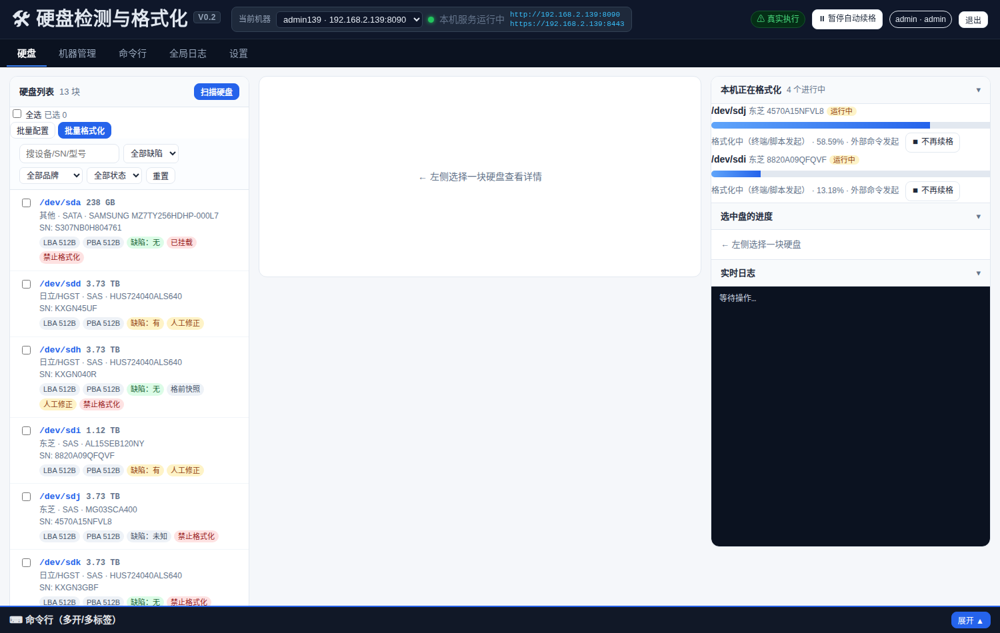

# diskwebui · 硬盘检测与格式化 Web 管理平台

> ## ⚠️ 本项目为「仅限内网使用」版本（Intranet / LAN Only）
> 面向机房内网环境设计与验证，**请勿直接暴露到公网**：默认无公网加固（自签证书、简单口令、无限流/WAF）。如确需外网访问，请自行加反向代理 + 访问控制 + 强口令 + 正式证书。
> 另外注意：格式化会**永久销毁硬盘数据**，操作前务必确认目标盘（系统盘/挂载盘默认已拦截）。

> 网页端的硬盘批量检测 / 缺陷判定 / 格式化系统：插盘自动识别 → 缺陷判断 → 自动格式化 → 复检 → 自动续格，支持多台机器统一管理。



---

## 目录

- [🎉 v4.0 版本更新说明（2026-09-30）](#-v40-版本更新说明2026-09-30)
- [设备要求（推荐配置）](#设备要求推荐配置)
- [终端适配（各终端 / 各分辨率）](#终端适配各终端--各分辨率)
- [功能特性](#功能特性)
- [目录结构](#目录结构)
- [版本](#版本)
- [部署](#部署)
- [文档](#文档)
- [安全与注意事项](#安全与注意事项)

---

## 🎉 v4.0 版本更新说明（2026-09-30）

**当前版本：v4.0（应用内显示 V0.4）**（每个版本逐条对照的「新增了 / 修复了 / 优化了 / 删除了」见 [版本更新记录（CHANGELOG.md）](CHANGELOG.md)）

### 一、新增功能

**1、真终端（命令行页 + 底部命令行）**
- 命令行页与底部抽屉都由「输入框 + 纯文本」升级为**真伪终端（PTY）**：**Tab 补全、Ctrl+C / Ctrl+R、方向键、彩色输出、光标**全部可用，`vim` / `top` 等全屏程序正常
- 前端内置 **xterm.js 5.5.0 + addon-fit + addon-web-links**（`public/vendor/`，**离线可用、不依赖外网 CDN**）
- 后端自写 `scripts/ptyshell.py`（纯标准库 `pty`）分配真伪终端，双向原始字节对通；新增会话接口 `POST /api/v1/terminal/{id}/input|resize|close`（远程机器走 `/machines/{mid}/terminal/…` 反代）
- **终端内危险命令预拦截**：默认拦截 `format / hugo / sg_format / of=/dev/sd…` 等；被拦时提示在命令前加 `DWCONFIRM=1` 回车重发即放行；开关在设置页「真终端保护」
- **工作目录跟踪**用 OSC 7 上报（终端里不可见），服务端解析后同步「工作目录」

**2、品牌识别：四层判定 + 联网兜底（默认关闭）**
- 层级：**①人工修正（按 SN）→ ②型号规则 → ③OEM 型号表 → ④WWN OUI → ⑤本地缓存 → ⑥联网兜底（开了才查）**
- 新增 `lib/brandlookup.js`：联网兜底走 Bing 抓取 + 评分（**必须领先第二名 2 倍才判定，否则拒绝乱猜**），结果写本地缓存并标「待确认」；查询只用中性词，避免自我印证
- 新增 **OEM 型号表**（收录有证据的 HP/HPE 贴牌）与 **WWN OUI 表**（HGST / 东芝 / 希捷 / 西数）
- 新增 **HP/HPE 贴牌型号解析**（读容量/接口/速率，仅在接口未知时补位）
- 列表新增「**品牌来源**」徽标与「**品牌待确认**」提示，详情页显示来源

**3、格式化许可模型**
- 人工修正由"直接改判定"改为"**许可**"：**允许格式化 / 禁止格式化 / 不干预**，只影响"能不能格"，不再改自动判定结果
- 未识别品牌时的工具兜底：**SAS → `sg_format`**，**SATA → 不下发默认**（人工在页面上选）

### 二、问题修复（共 8 条）

**终端类（4 条）**
- 修复了**关闭标签后旧内容残留**的问题（关最后一个标签会清屏并释放服务端会话）
- 修复了**终端重连时历史输出重复回放**（同屏两遍）的问题（新增 `replay` / `live` 事件）
- 修复了终端**首次连接按 80×24 排版、尺寸不符**的问题（首连即按窗口尺寸建 PTY）
- 修复了命令行页**终端空白过大**的问题（高度跟随内容，全屏程序自动撑满）

**布局显示类（3 条）**
- 修复了**窄窗口下快捷按钮被终端挡住/挤出视口**的问题
- 修复了**底部命令行在其他页面也显示并遮挡内容**的问题（只在硬盘页显示，展开时自动预留空间）
- 修复了**收起状态的抽屉白占高度**的问题

**识别执行类（1 条）**
- 修复了**伪设备（zram / loop / ram / sr / fd / md* / dm-*）混进硬盘列表**的问题

### 三、优化改进
- **上下终端彻底解耦**：命令行页与底部抽屉各自独立（各自标签/会话），互不影响；关标签真正释放会话（杀 PTY 进程树 + 清临时 rc + 落审计）
- **缺陷判定口径锁死**：SATA 只看 `05 / 196 / 197`（**198 / 199 可清除、不计缺陷**）；SAS 看 G-list
- **放行策略**：缺陷「未知」默认放行并参与自动格式化；「未知盘」（型号与 SN 都认不出）默认拦截、可人工放行
- **品牌型号规则**按联网核对收敛：西数规则提前并改为「容量带 T 重复」+ `W(US|UH|UC|UD|SH)` 前缀；日立补 `HUA`；希捷补 `SKYHAWK`；东芝补 `MD0x` / `HDW[DNE]`（`MN0x` 证据不足不纳入）

### 四、其他改动
- **删除**命令行页的「受控执行」输入行与底部抽屉的纯文本输出/「执行」按钮（危险命令统一走终端内预拦截；受控执行通道保留在设置里）
- 新增文件：`src/lib/brandlookup.js`、`src/scripts/ptyshell.py`、`src/scripts/release_checklist.md`、`src/public/vendor/`（xterm 及其插件）
- **修复同步地雷**：`build.js` 同步文件清单补齐 `lib/brandlookup.js` 与 `public/vendor/*`（漏列会导致节点同步漏拷、启动即崩），`autoupdate.js` 更新包改为全量覆盖，`detect.js` 对兜底模块改为可选加载
- **回归测试**：`src/scripts/ui_suite.mjs`（65 项断言）在 HTTP 与 HTTPS 两种入口均通过；发布前按 `scripts/release_checklist.md` 走一遍
- **运行环境**：Ubuntu 24.04 + Node.js v26 实测；HTTP(8090) 与 HTTPS(8443 自签) 两种入口均验证

---
## 设备要求（推荐配置）

> 本系统分三类角色：**管理端服务器**（跑本程序）、**被管理的目标机器**（跑硬盘操作的节点）、**访问页面的终端**（PC/安卓/iOS 浏览器）。

### ① 管理端服务器（运行本系统）
| 项 | 推荐配置 |
|---|---|
| 处理器 | Intel i5 及以上（或同性能 AMD） |
| 内存 | **8GB 及以上**（同时跑浏览器回归测试建议 ≥ 8GB） |
| 磁盘 | ≥ 20GB 可用（含日志、备份与源码包） |
| 系统 | Linux（Ubuntu 20.04+ 等），内核 5.x 以上 |
| 运行环境 | **Node.js ≥ 18**（推荐 20+） |
| 权限 | **需要 root**（smartctl / sg_format / hugo / wdckit 需特权） |
| 端口 | 8090（HTTP）、8443（HTTPS 自签） |
| 网络 | 与所有目标机器内网互通 |

### ② PC 端（浏览器访问，Windows / macOS / Linux）
| 项 | 推荐配置 |
|---|---|
| 处理器 | Intel i5-8250U 及以上（或同性能 AMD） |
| 内存 | **8GB 及以上**（管理多台机器、跑批量任务建议 16GB） |
| 显卡 | 无要求（纯网页端，核显即可） |
| 系统 | Windows 10 64 位 / macOS 12+ / 主流 Linux 桌面 |
| 浏览器 | **Chrome / Edge 100+ 或 Firefox 100+** |
| 分辨率 | 1366×768 及以上（≥1920×1080 体验最佳） |

### ③ 安卓端（手机 / 平板浏览器）
| 项 | 推荐配置 |
|---|---|
| 处理器 | 骁龙 7 系及以上（或同性能联发科/麒麟） |
| 内存 | 4GB 及以上 |
| 系统 | Android 9 及以上 |
| 浏览器 | Chrome 100+ / 系统浏览器（Chromium 内核） |
| 屏幕 | 5.5 英寸及以上（页面已适配手机竖屏） |

### ④ iOS 端（iPhone / iPad）
| 项 | 推荐配置 |
|---|---|
| 机型 | iPhone 8 及以上 / iPad（iOS 15 及以上） |
| 浏览器 | **Safari**（WebKit 内核，已实测通过） |
| 屏幕 | 4.7 英寸及以上（页面已适配手机竖屏） |

### ⑤ 被管理的目标机器（节点）
| 项 | 要求 |
|---|---|
| 系统 | Linux（管理端可 `http://IP:8090` 访问） |
| 必需工具 | `smartmontools`、`sg3-utils`、`lsscsi` |
| 格式化工具 | hugo（日立/HGST）、wdckit（西数）、`sg_format` / SeaChest（SAS） |
| 网络 | 与主服务器内网互通，默认从主源同步代码 |

---

## 终端适配（各终端 / 各分辨率）

页面已做**全站自适应**：**页面本体不出现纵向滚动条**，顶部栏固定，表格/面板在各自区域内滚动；窄屏时表格自动出现横向滚动条（列不会被压扁）。

| 终端类型 | 分辨率（实测） | 结果 |
|---|---|---|
| 超宽屏 | 2560×1440、2560×1600@2x | ✅ 正常 |
| 桌面显示器 | 1920×1080、1600×900、1366×768、1280×800 | ✅ 正常 |
| 高 DPI / 缩放 | 1.25x、1.5x、2x、3x | ✅ 正常 |
| 平板（横/竖） | 1024×768、834×1112（触摸） | ✅ 正常（三栏自动堆叠） |
| 手机 | 414×896、375×667（触摸） | ✅ 可查看与操作 |

**浏览器兼容（实测）**：Chrome ✅ · Firefox ✅ · Safari（WebKit 内核）✅ · Edge（Chromium 同内核）✅
**回归测试**：`src/scripts/ui_suite.mjs`（65 项断言），支持 `BASE=http://…` 或 `BASE=https://…:8443`。

---

## 功能特性

- **多机器管理**：以机器 IP 为入口（`http://机器IP:8090`），增删改查、连接测试、在线状态、快速跳转；列表支持**排序（多条件/自定义序列）、筛选、搜索、命名视图、批量操作、导入导出（9 种格式）、打印**
- **硬盘识别**：品牌（日立/HGST、西数、希捷、东芝）四层判定（型号规则 / OEM 型号表 / WWN OUI / 联网兜底）、接口（SAS/SATA/NVMe）、容量、序列号、逻辑/物理块大小
- **缺陷判定**：SAS 判 G-list；SATA 判 SMART `05/196/197`（**198/199 可清除、不计入**）；缺陷「未知」默认放行，「未知盘」默认拦截
- **只改逻辑块大小的格式化**：512 / 520 / 4096 / 4160，不涉及文件系统与分区表
- **插盘自动检测 + 自动格式化 + 自动续格**：格完复检仍有缺陷才续格；全局暂停 / 单盘截停互不干扰（主从模型）
- **人工修正优先**：品牌 / 接口 / 块大小可人工覆盖，缺陷改为「格式化许可」（允许 / 禁止 / 不干预），自动识别结果同时展示
- **真终端**：顶部多开命令行 + 底部命令行抽屉，均为真 PTY（Tab 补全 / Ctrl+C / Ctrl+R / vim / 彩色），上下各自独立
- **多机自动同步**：主服务器为唯一代码源，节点空闲时自动跟版（主源可达时永不使用备用源）
- **安全**：三级角色（viewer/operator/admin）、危险操作二次确认、审计留痕、系统盘/挂载盘默认拦截

---

## 目录结构

```
diskwebui/
├── README.md                 # 本文件：项目说明（含设备要求、终端适配、部署）
├── CHANGELOG.md              # 更新修复及优化一览（按日期逐条列出 新增/修复/优化/删除）
├── docs/                     # 项目文档（含规划/部署/问题/测试/运维，及界面截图）
├── src/                      # 当前版本源码（可直接部署）
│   ├── server.js             # HTTP(S) 服务、路由、鉴权、调度器
│   ├── lib/                  # detect / rules / exec / autoformat / autoupdate / store ...
│   ├── public/               # 前端 index.html + app.js + style.css（无框架）+ vendor/（xterm.js 终端）
│   └── scripts/              # 辅助脚本（标签生成、PTY 伪终端、UI 回归测试套件、发布检查清单）
└── versions/                 # 历史版本归档（含版本对照表）
    ├── v1.0/diskwebui_v1_src.tar.gz
    ├── v2.0/diskwebui_v2_src.tar.gz
    └── v3.0/diskwebui_v3_src.tar.gz
```

---

## 版本

| 版本 | 日期 | 说明 |
|---|---|---|
| **v4.0** | 2026-09-30 | **当前版本**（应用内显示 V0.4）。真终端（xterm.js + PTY）、品牌四层判定 + 联网兜底、格式化许可模型、修复 8 个问题 |
| **v3.0** | 2026-09-24 | 机器列表全面升级（排序/筛选/视图/批量/导入导出 9 格式/打印/分页/多用户偏好）、全站 5 页自适应、修复 5 个真 bug |
| **v2.0** | 2026-09-20 | 修复 14 个开发期 + 9 个部署期问题；新增插盘自动检测/自动格式化/自动续格（主从模型）、磁盘空间保护、多机主源优先同步 |
| **v1.0** | 2026-09-16 | 第一版。多机管理 + 硬盘检测 + 缺陷判定 + 手工格式化 + 命令行 |

**每个版本相对上一版的「新增 / 修复 / 优化 / 删除」逐条清单，见 [版本更新记录（CHANGELOG.md）](CHANGELOG.md)。**

---

## 部署

### 快速部署（单机）
```bash
# 1) 依赖
sudo apt update && sudo apt install -y smartmontools sg3-utils lsscsi

# 2) 放置代码
mkdir -p ~/disk_webui && cd ~/disk_webui
tar xzf diskwebui_v4_src.tar.gz --strip-components=1     # 或直接拷贝 src/ 下的内容
mkdir -p data                                            # 运行时数据（首次启动生成默认配置）

# 3) 配置 data/settings.json：nodePort=8090、工具路径、admin 账号（上线后请勿再改 admin）

# 4) 常驻服务（root 运行，smartctl 需要）
sudo tee /etc/systemd/system/diskwebui.service >/dev/null <<'EOF'
[Unit]
Description=Disk WebUI
After=network.target

[Service]
Type=simple
User=root
WorkingDirectory=/home/<user>/disk_webui
ExecStart=/usr/bin/node server.js
Restart=always
RestartSec=5
KillMode=control-group

[Install]
WantedBy=multi-user.target
EOF
sudo systemctl daemon-reload && sudo systemctl enable --now diskwebui

# 5) 验证
systemctl is-active diskwebui                                    # active
curl -s -o /dev/null -w '%{http_code}\n' http://127.0.0.1:8090/  # 200
```

访问 `http://机器IP:8090`（HTTPS：`https://机器IP:8443`，自签证书浏览器会提示不安全，属正常）。**多机部署与问题排查见文档第七章。**

### 多机部署与同步
1. 主服务器（如 `192.168.2.139`）按上面步骤部署，作为唯一代码源；
2. 其它机器部署同版本后，在「机器管理」里加入各机（或粘贴 IP 列表批量导入）；
3. 节点每 5 分钟检查主源版本，**空闲时自动跟版**；主源不可达时才允许使用备用源，并写审计记录；
4. 机器列表可导出/导入（9 种格式），换机或扩容时直接导入。

---

## 文档

[**硬盘检测与格式化 Web 管理界面规划（V0.2 实现版）**](docs/硬盘检测与格式化%20Web%20管理界面规划（V0.2%20实现版）.md)

- 一、立项与项目目标　二、需求分析　三、系统架构　四、功能模块实现
- 五、页面结构与界面　六、代码实现要点　**七、部署手册（照做可上线）**
- **八、开发期问题与解决（14 项）　九、部署期问题与解决（9 项）**
- 十、测试与 Bug 修复（6 层测试体系 + 真机端到端验证）　十一、日常运维与故障处理

版本变更记录：[版本更新记录（CHANGELOG.md）](CHANGELOG.md)　|　版本归档：[versions/README.md](versions/README.md)

---

## 安全与注意事项

- **仅内网使用**；不要映射到公网，不要在公网端口上开启本服务；
- 首次登录后请**修改默认口令**（admin 账号名请保持默认，系统内部按此账号做同步鉴权）；
- 格式化会**永久销毁数据**：系统盘、已挂载盘默认拦截；请务必人工确认目标盘；
- 生产使用建议：定期备份 `data/`（含配置、审计与历史）、开启 HTTPS、限制可访问来源 IP。
