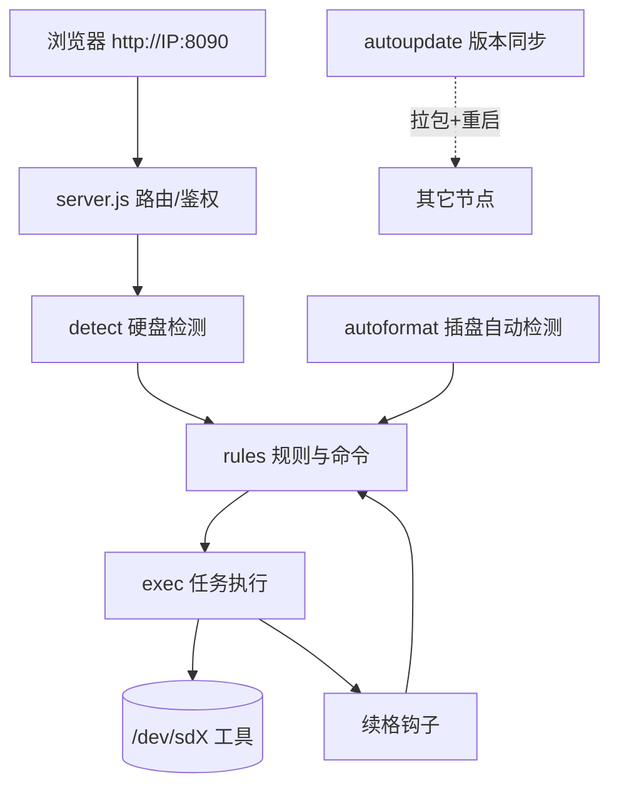
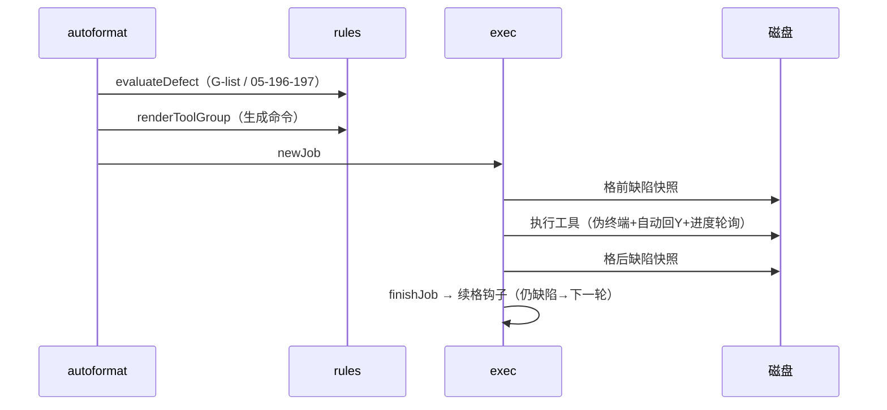
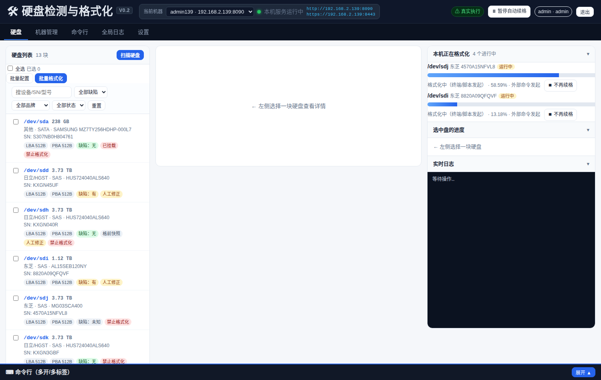
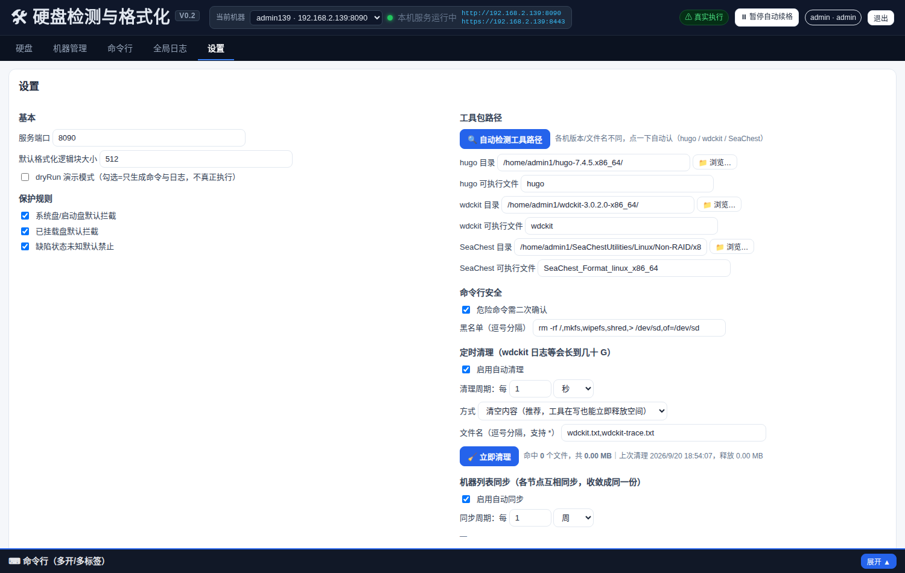
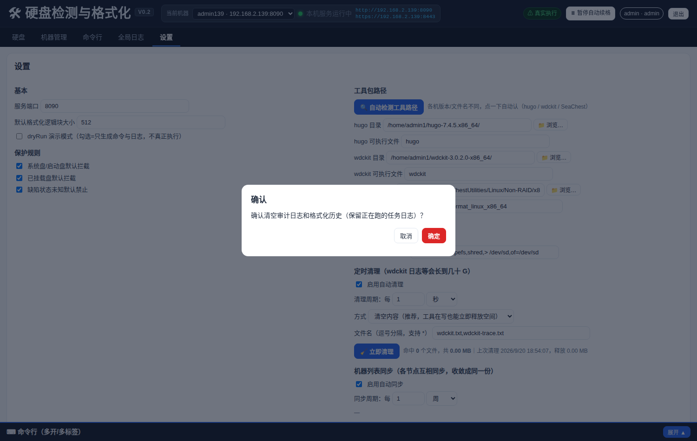

# 硬盘检测与格式化 Web 管理界面规划（V0.2 实现版）

- **版本**：V0.1（需求）→ **V0.2（实现版，本文件）**
- **定位**：多机器 IP 访问、硬盘自动识别、缺陷判断、只改变逻辑块大小的格式化、工具手动选择、顶部多开命令行、可持续迭代
- **核心原则**：人工修正 > 自动识别；格式化只改变逻辑块大小（不涉及文件系统/分区表）；危险操作二次确认；系统盘、挂载盘、未知状态默认拦截
- **V0.1 → V0.2 主要变化**：
  1. 由"中心管理端可选"落地为**主服务器（139）+ 节点自动同步更新**；
  2. 新增**插盘自动检测 + 自动格式化 + 自动续格**（V0.1 未规划）；
  3. 新增**用户与权限**（viewer/operator/admin）与审计留痕；
  4. 前端全面弃用原生 `confirm/prompt`（会冻结页面）；
  5. 修复 14 个开发期问题 + 9 个部署期问题（详见第八、九章）。

---

## 一、立项与项目目标

| V0.1 目标 | 实现情况 |
|---|---|
| 用机器 IP 访问对应机器的硬盘管理界面 | ✅ `http://机器IP:8090`（HTTPS 8443） |
| 多机器 IP 增删改查、连接测试、在线状态、快速跳转 | ✅ 完整实现，含批量导入 |
| 自动识别品牌（日立/HGST、西数、希捷、东芝、其他） | ✅ 按 `smartctl -j -i` 判定，可人工修正 |
| 自动识别接口（SAS/SATA/NVMe/其他） | ✅ 优先 `smartctl` 协议字段，避免"SAS 背板插 SATA 盘"误判 |
| 自动识别逻辑/物理块大小、容量、序列号、型号 | ✅ |
| SAS 判 G-list；SATA 判 SMART 05/196/197 | ✅（**198/199 不计入缺陷**，可由人工清零） |
| 按缺陷规则决定是否允许下次格式化 | ✅ 有→允许；无→停止；未知→默认禁止（可人工覆盖） |
| 格式化只改逻辑块大小 | ✅ 512/520/4096/4160 |
| 显示逻辑块大小、进度、实时日志 | ✅ 工具无百分比时用 `sg_turs` 兜底 |
| 人工修正品牌/接口/缺陷/逻辑块大小 | ✅ 按序列号持久化（`overrides.json`） |
| 手工选择工具与块大小 | ✅ |
| 顶部命令行，多开多标签 | ✅ 真 PTY（cd/环境变量/↑↓/Ctrl-C 可用） |
| 架构可迭代（新增品牌/工具/规则/页面） | ✅ 适配器 + 命令模板 + `/api/v1` 版本化 |

---

## 二、需求分析（核心需求确认表）

| # | 需求 | 实现要求 | 状态 |
|---|---|---|---|
| 1 | 机器 IP 作为网址 | 每台机器跑本地服务，访问 `http://IP:8090` | ✅ |
| 2 | 多机器 IP 管理 | 增删改查、连接测试、在线状态、打开页面 | ✅ |
| 3 | 硬盘识别 | 品牌/接口/逻辑块/物理块/容量/序列号/型号 | ✅ |
| 4 | 缺陷判断 | SAS→G-list；SATA→05/196/197 | ✅ |
| 5 | 格式化规则 | 有缺陷→继续；无→停止；未知→默认拦（可覆盖） | ✅ |
| 6 | 品牌工具映射 | 日立/西数/希捷/东芝各用各的工具，亦可手动选 | ✅ |
| 7 | 逻辑块大小 | 默认 512，可选 512/520/4096/4160 | ✅ |
| 8 | 人工修正优先 | 同时显示"自动识别"与"当前采用" | ✅ |
| 9 | 顶部命令行 | 多开、多标签、可批量 | ✅ |
| 10 | 可迭代 | 工具适配器/命令模板/组件化/API 版本化 | ✅ |
| **11** | **（V0.2 新增）插盘自动检测** | 5 秒感知插拔，新盘先格一遍 512 再判定 | ✅ |
| **12** | **（V0.2 新增）自动续格** | 格完复检仍缺陷→自动再格；支持全局暂停与单盘截停 | ✅ |
| **13** | **（V0.2 新增）权限与审计** | viewer/operator/admin 三级；关键动作写 audit | ✅ |
| **14** | **（V0.2 新增）多机自动同步** | 以主服务器为唯一代码源，节点空闲自动跟版 | ✅ |

**非功能要求**：①单机 ≥12 块盘并行不卡；②服务重启不得杀死正在进行的格式化；③3–6 小时的长格式化不得被误判超时；④前端不得出现会冻结页面的原生弹窗。

---

## 三、系统架构

### 3.1 部署架构（V0.1 建议 → 实际落地）
- **节点服务**：每台被管机器安装本地服务，监听 `0.0.0.0:8090`（HTTPS 8443），扫描本机硬盘、执行格式化、推送进度、提供命令行。
- **中心管理端**：落地为**主服务器（如 192.168.2.139）**，维护机器列表并可反向代理访问各节点；**同时是代码唯一源**。
- **自动同步**：节点每 5 分钟比对版本指纹，**主源优先**（主源连续 3 次不可达才允许用备用源）；有格式化任务在跑时等待空闲再更新。



### 3.2 数据流（一次自动格式化）


### 3.3 目录结构
```
disk_webui/
├── server.js          # HTTP(S)、路由、鉴权、调度器
├── lib/               # detect/rules/exec/autoformat/autoupdate/clean/space/store/build/tls
├── public/            # index.html / app.js / style.css
├── scripts/           # 辅助脚本
└── data/              # 运行时数据（settings/machines/overrides/audit/history）★不随源码分发
```

---

## 四、功能模块实现

### 4.1 机器管理
新增/编辑/删除（仅移除记录）/查询/连接测试/打开页面/批量导入（粘贴 IP 列表或 CSV）。

### 4.2 硬盘列表与详情
字段：设备名、序列号、型号、品牌、接口、容量、逻辑块/物理块大小、缺陷判断方式、缺陷值（G-list / 05·196·197）、状态、操作（详情/重新检测/开始格式化）。
详情区同时显示"**自动识别**"与"**当前采用**"（可改），人工修正按序列号持久化。

### 4.3 格式化（只改逻辑块大小）
- 块大小可选 512/520/4096/4160；
- **命令生成三条硬规则**：
  1. 单盘一律**按序列号**精确指定（hugo `-s`、wdckit `--serial`）；
  2. 仅当"该型号的盘**全部**都在本批内"才允许 `-m/--model`（批量提速）；
  3. 批量：hugo `format -s A -s B --merge`；wdckit `format --serial A --serial B`；SAS 东芝/希捷 `sg_format` 用 `xargs -P` 并行。
- 危险操作**二次确认**（勾选框）；系统盘/挂载盘/无缺陷盘默认拦截。

### 4.4 插盘自动检测与自动格式化（V0.2 新增）
周期扫描（默认 60s）+ 插拔事件（默认 5s）；新盘**先无条件格 512**，再按缺陷判定是否续格；**正在格式化/已有任务的盘一律跳过**；连续失败达阈值→**搁置**（`data/autoformat-fails.json`）。

### 4.5 自动续格（主从模型）
| 操作 | 效果 |
|---|---|
| 全局暂停 | 该机器**所有盘**停止续格（清空"单盘放行"） |
| 全局续格 | 该机器**所有盘**恢复续格（清空"不再续格"标记） |
| 单盘「不再续格」 | **只影响该盘**，全局按钮不变 |
| 单盘「恢复续格」 | 全局暂停时=**只放行该盘**；否则=移出停止名单 |
| 顶部切换机器 | 以上按钮**跟随选中的机器**（含远端代理） |

### 4.6 顶部命令行
多开多标签、独立会话、真 PTY（cd/环境变量/历史/Ctrl-C/vim 可用）、可选择目标机器、白/黑名单 + 危险命令二次确认。

### 4.7 设置与运维
工具路径、并发、超时、自动更新（主源/备用源）、自动续格、用户管理、备份/恢复、清理日志、证书续期、格式化历史（导出 CSV）、模板管理。

### 4.8 权限与审计
三级角色；`/api/v1` 全部接口按角色校验；关键动作（格式化/截停/暂停/清理/备份/override/用户变更）写 `data/audit.jsonl`。

---

## 五、页面结构与界面

单页仪表盘：**顶部**（当前机器/服务状态/扫描/机器管理/命令行/日志/设置）＋**左侧**硬盘列表＋**中间**硬盘详情与操作＋**右侧**「本机正在格式化」/进度/实时日志。



*图 1 首页：左侧硬盘列表（型号/序列号/接口/容量/缺陷），右侧「本机正在格式化」与选中盘进度。*



*图 2 设置页：自动续格控制、运维按钮（备份/恢复/证书/清理）、格式化历史与命令模板。*

---

## 六、代码实现要点

| 模块 | 关键点 |
|---|---|
| `lib/detect.js` | `smartctl -j -H -A -i` 为准取品牌/接口/块大小/序列号；`lsblk` 判系统盘与挂载 |
| `lib/rules.js` | `evaluateDefect()` 判定；`renderCommand/renderToolGroup()` 生成命令；`preflight()` 前置校验 |
| `lib/exec.js` | 伪终端执行、自动回 Y、真实进度轮询、缺陷快照、任务收尾与续格、**进程树管理** |
| `lib/autoformat.js` | 定时/插盘触发、新盘先格 512、跳过忙盘、失败搁置 |
| `lib/autoupdate.js` | 版本指纹比对、主源优先、空闲才更新、校时 |
| `lib/store.js` | JSON/JSONL 读写 + 默认值（含 `stopSerials/allowSerials`） |
| `public/app.js` | 无框架前端：自制弹窗、机器维度接口、4s 轮询、按钮状态与后端一致 |

**执行工具的三个必备条件（否则一定踩坑）**：
1. 必须有**伪终端**：`script -qfc '<cmd>' /dev/null`；
2. 必须**自动回 Y**，且**不能依赖 node 的 stdin 管道**（服务重启会关管道→杀任务）：用 `printf 'Y\n' | script -qfc …`；
3. 必须有**进度兜底**：工具不打印百分比时轮询 `sg_turs -v` 的 `Progress indication`。

---

## 七、部署手册（照此可上线）

### 7.1 环境
Ubuntu 20.04+ / Node ≥18 / `smartmontools` `sg3-utils` `lsscsi`；格式化工具放好（路径可在设置页改）；端口 8090(HTTP)、8443(HTTPS)。

### 7.2 步骤
```bash
sudo apt update && sudo apt install -y smartmontools sg3-utils lsscsi
mkdir -p ~/disk_webui && cd ~/disk_webui
tar xzf diskwebui_v2_src.tar.gz --strip-components=1
mkdir -p data                       # 运行时数据目录（首次启动生成默认配置）

# 关键配置：data/settings.json
#   nodePort=8090、toolPaths.hugo/wdckit/seachest、auth.users[0]={admin,强密码,admin}

sudo tee /etc/systemd/system/diskwebui.service >/dev/null <<'EOF'
[Unit]
Description=Disk WebUI
After=network.target
[Service]
Type=simple
User=root
WorkingDirectory=/home/<user>/disk_webui
ExecStart=/usr/bin/node server.js
Restart=always
RestartSec=5
KillMode=control-group
[Install]
WantedBy=multi-user.target
EOF
sudo systemctl daemon-reload && sudo systemctl enable --now diskwebui

systemctl is-active diskwebui                                   # active
curl -s -o /dev/null -w '%{http_code}\n' http://127.0.0.1:8090/  # 200
```

### 7.3 多节点（可选）
主服务器：`syncSeeds[0]`=本机 IP，机器列表加入其它节点；节点：`syncSeeds[0]`=主服务器 IP、`autoUpdate.enabled=true`。
**规则：主服务器在线时节点只认主源。**

### 7.4 上线检查清单
- [ ] 服务 active、8090/8443 可访问
- [ ] admin 可登录（**上线后不要再改 admin 账号/密码**）
- [ ] 能扫到全部硬盘、系统盘识别正确
- [ ] 手动格一块测试盘：进度与格前/格后快照正常
- [ ] 拔插一块盘：5 秒内界面感知
- [ ] 备份一次配置

---

## 八、开发期遇到的问题与解决（14 项）

| # | 现象 | 根因 | 解决 |
|---|---|---|---|
| 1 | 工具启动报 `Error opening terminal: unknown.` | 工具需要 TTY | 用 `script -qfc '<cmd>' /dev/null` 包伪终端 |
| 2 | 停在 `Are you sure…(Y/N)`，进度永远 2% | 没人回 Y | stdin 预置 `printf 'Y\n'`；识别提示自动回 Y |
| 3 | 界面长期 2%，像卡死 | 工具不打印百分比 | 20s 轮询 `sg_turs` 的 `Progress indication` |
| 4 | `/api/v1/jobs` 返回 500 | Node 定时器对象混进 JSON（循环引用） | `pub()` 剔除 `subs/child/log/timer/tail/watch/...` |
| 5 | **服务重启→正在格的盘断掉（白跑几小时）** | 用 node 的 stdin 管道回 Y，node 退出管道关闭→子进程 EOF 死 | 改 `printf 'Y\n' \| script -qfc …`（与 node 无管道）+ 把任务移出服务 cgroup |
| 6 | 盘"忽隐忽现"、假进度 | 遗留 `script` 会话空转堆积 | 启动/定期清理空转会话（采样 10s 无 IO 才结束） |
| 7 | **同型号盘被一起格式化** | 工具 `-m/--model` 按型号匹配 | 默认改**按序列号**；批量也只在"整批同型号"时才用 `-m` |
| 8 | 格失败也判成功→无限续格 | 工具报错仍返回退出码 0 | 识别 `No devices found / Command Execution Failed / Error code`；加**轮次上限**与**失败搁置** |
| 9 | **"already running" 被当完成→12 秒一轮死循环** | 单实例工具秒退且码 0 | 识别 `already run(ning)`→不判完成、不续格，60s 后重试 |
| 10 | 超时/拔盘后工具还在跑 | 只杀了外层 `bash/script` | `killProcTree()`：**进程组 + 递归子孙**一起杀 |
| 11 | "移出服务 cgroup"没生效 | cgroup v2 迁移只作用于单进程 | 移**整棵进程树**，并在 0.4/1.5/4s 补做 |
| 12 | **自动检测整条链路失效，日志刷 1417 行** | TDZ：引用了尚未声明的 `const cfgFmt` | 改为压入实际配置 `cfg512/r512` |
| 13 | 正在格式化的盘被反复排 0 秒失败任务 | 只判"任务在跑"，没判"盘在格" | `sg_turs` 返回 `format in progress`→跳过 |
| 14 | **3–6h 长格式化被 3600s 误判失败** | 固定超时，进度不延长 | 到点先判 `shouldExtendJobTimeout()`，仍在格就延长；硬上限 24h |

---

## 九、部署期遇到的问题与解决（9 项）

| # | 现象 | 根因 | 解决 |
|---|---|---|---|
| 1 | 节点升级后代码又变旧 | 在非主服务器上改代码，被自动同步整包覆盖 | **只改主服务器**，或改完立即推回主源 |
| 2 | 按钮点了没反应/消失 | 前端新、后端进程旧→新接口 404 | 部署后**必须重启服务**确认前后端一致 |
| 3 | 改了前端页面没变化 | 静态文件无缓存头，浏览器吃缓存 | html/js/css 返回 `no-cache, must-revalidate` |
| 4 | **点按钮整个网页卡死** | 原生 `confirm/prompt` 同步阻塞页面（远程控制台甚至不渲染） | 全站改**自制弹窗**（非阻塞） |
| 5 | 远端机器"不再续格"标到了本机 | 前端写死请求本机接口 | 新增机器维度接口，前端跟随下拉选中机器 |
| 6 | 端口不通 | 服务未启动/崩溃 | `systemctl status`；`Restart=always` |
| 7 | 时间漂移 | 节点未校时 | `autoUpdate.syncTime=true`（以东八区主源校时） |
| 8 | 磁盘被工具日志吃满 | `wdckit.txt` 等可达几十 G | `lib/clean.js` 定时截断 + 系统日志上限 |
| 9 | HTTPS 证书过期 | 自签证书有效期 | 设置页「检查/续期证书」，上线前执行一次 |



*图 3 自制确认弹窗：点击后页面仍可响应，不会像原生弹窗那样冻结整页。*

---

## 十、测试与 Bug 修复

### 10.1 测试体系（分层、脚本化、一键运行）
| 层 | 脚本 | 覆盖 | 最近结果 |
|---|---|---|---|
| 静态白盒 | `static_test.js` | 语法、重复 id、**前端引用不存在的元素**、**前端接口 vs 后端路由** | 17 PASS / 0 FAIL |
| 单元白盒 | `unit_test.js` | 命令生成矩阵、缺陷判定、TDZ 回归、进程树、cgroup、store、指纹、超时延长 | 22 PASS / 0 FAIL |
| 集成黑盒 | `api_test.js` | 鉴权、15 个 GET 结构、写操作往返+还原、400/404、跨机代理 | 29 PASS / 0 FAIL |
| 系统灰盒 | `sweep_test.js` | 真浏览器**点遍每个控件**：不卡/无原生弹窗/无 JS 错 | 100 控件 PASS |
| 验收 | `af_master_test.js` | 主从 5 条规则 | 6 PASS / 0 FAIL |
| 验收(跨机) | `matrix_test.js` / `cross_test.js` | 动作只落在选中机器 | 全 PASS |

**"卡住"的判定标准**：点击后 4 秒内页面仍能执行 JS，且**不出现原生 confirm/prompt**。

### 10.2 真机端到端验证（12 块真实硬盘）
| 轮次 | 做法 | 结果 |
|---|---|---|
| 第 1 轮 | 给干净盘打"有缺陷"，看是否自动接管 | 抓到"同型号 3 块被一起格"并修复 |
| 第 2 轮 | 修复后复验自动排队命令 | ✅ 生成 `hugo format -s <SN> --merge -b 512`（**单盘 -s**） |

### 10.3 纪律
每次改动按 `静态 → 单元 → 集成 → 系统 → 验收` 回归，**全绿才推送到其它机器**。

---

## 十一、日常运维与故障处理

**常用操作**：单盘截停=任务行「⏹ 不再续格」；全局暂停=顶部「⏸ 暂停自动续格」；清历史=设置页「清空历史/日志」；备份/恢复=设置页；导出历史=「导出 CSV」。

| 现象 | 先查 | 处理 |
|---|---|---|
| 网页打不开 | `systemctl status diskwebui`、8090 | 重启服务；看 `/var/log/diskwebui.log` |
| 盘不显示/0B | 供电/背板/线缆、`dmesg` | 复位或**断电重启机器**（会中断任务） |
| 任务卡在"调用工具" | 是否 `already running`、有无遗留会话 | 等 60s 自动重试；必要时清空转会话 |
| 格总失败 | `sg_turs -v` 是否 NOT READY/无响应 | 无响应的盘需断电重启或换槽位 |
| 界面失败但进程在跑 | `ps -ef \| grep -E 'hugo\|wdckit\|sg_format'` | 升级到"整树杀"版本 |
| 节点不跟版 | 主源是否在线、节点是否有任务 | 空闲自动跟；或手动推包+重启 |

**备份**：只需备份 `data/`；恢复=停服务→覆盖 `data/`→起服务→设置页检查。

---

## 附录

| 文件 | 说明 |
|---|---|
| `diskwebui_v1_src.tar.gz` | **第一版源码**（修复前，2026-09-16 快照） |
| `diskwebui_v2_src.tar.gz` | **当前修复版源码**（不含 data/证书等敏感内容） |
| `images/` | 界面截图 |

```bash
# 检测
smartctl -j -H -A -i /dev/sdX      # SMART/接口/型号/序列号
sg_turs -v /dev/sdX                # 就绪 & 格式化进度
# 格式化
hugo format -s <Serial> --merge -b 512        # 日立/HGST
wdckit format --serial <Serial> --merge -b 512 # 西数
sg_format -v --format --size=512 /dev/sgN      # SAS（东芝/希捷）
# 服务
systemctl status|restart diskwebui ; tail -f /var/log/diskwebui.log
```

| 项 | 值 |
|---|---|
| 代码目录 | `~/disk_webui` |
| 数据目录 | `~/disk_webui/data`（`audit.jsonl`、`format-history.jsonl`） |
| 日志 | `/var/log/diskwebui.log`、`/var/log/diskwebui/jobs/*.log` |
| 端口 | 8090 / 8443 |

*（本文件只保存在 192.168.0.63 桌面，随源码一并归档到 GitHub。）*
